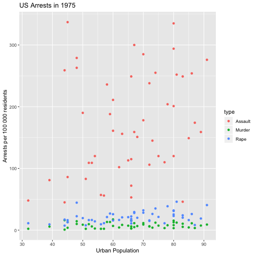

Peer Assignment 4, US Arrests
========================================================
author: Carlos Andres Sanchez B.
date: September 21, 2019
autosize: true

US Arrests
========================================================

The data used in this assigment can be found in here:
 
   <http://stats4stem.weebly.com/r-usarrests-data.html>

 
- Represents Violent Crime Rates by US State
- This data is collected in 1975

Data
========================================================

Description
========================================================

- With higher Population Urban rate, more arrests has been made
- Assaults represents the most common arrest
- There is more rapes than murder arrests in 1975, per 100 000 residents

Interactive Plot
========================================================

There is an interactive plot available for this data in the following
link:

- <https://casanchezbar.shinyapps.io/peerassignment4/>
